# MCQ Recruitment Exam With Django
The purpose of this examination system is recruitment. Question will appear in one page per question. Question should be answered within allocated time per question. Otherwise next question will appear. The time to answer each question will be recorded. This recorded time will be used for ranking examinee if the other participants have equal score. The questions will be presented one at a time. Examinee should finish answering within time limit. He/She can navigate to the next question. So there are a next button. Examinee don't have the facility of getting back to the previous question. The value of each question is one. After finishing the exam, the result will appear with rank(1st, 2nd,3rd for multiple examinee). The result board will point out the correct and incorrect answers.

## Installation
Before you do anything, you need to make sure that all the packages installed on our VPS are up to date. Open your terminal and type this comands.
```bash
$ sudo apt-get update
$ sudo apt-get upgrade
```
Now we need to install python 3.6 and postgresql. Most Django users prefer to use PostgreSQL as their database server. It is much more robust than MySQL and the Django ORM works much better with PostgreSQL than MySQL, MSSQL, or others. You need to install dependencies for PostgreSQL to work with Django.
you need to create a database, create a user, and grant the user we created access to the database we created. 
```bash
$ sudo su - postgres
postgres@user:~$  psql
postgres=# CREATE DATABASE recruitment;
postgres=# CREATE USER ergo WITH PASSWORD 'ergoventures';
postgres=# GRANT ALL PRIVILEGES ON DATABASE recruitment TO ergo;
postgres=# \q
postgres@user:~$  exit
```
Installing virtualenv is very simple. Just run the command below:
```bash
$ sudo apt-get install python3-pip
$ sudo pip3 install virtualenv 
```
Now you just need to clone this project from github.
```bash
$ git clone https://github.com/Sheikh2Imran/MCQ-Recruitment-Exam-with-Django.git
```
There are total 9 branch. Checkout from the latest branch. 
```bash
$ git checkout development_V1.0
```
Now let’s create a virtualenv
```bash
$ sudo virtualenv venv
```
Now you need to activate our virtualenv so that when you install Python packages they install to your virtualenv. This is how you activate your virtualenv:
```bash
$ source venv/bin/activate
```
You should now see that “(venv)” has been appended to the beginning of your terminal prompt.

Now install all pip package from requirements.txt
```bash
(venv) $ pip install -r requirements.txt
```
Now you need a local_settings.py file to get all the configuration. Go to recruitment folder and rename local_settings_example.py to local_settings.py.

Now you need to makemigrations and migrate to migrate your database.
```bash
(venv) $ python manage.py makemigrations
(venv) $ python manage.py migrate
```
After migration, you can create a super user as you will.
```bash
(venv) $ python manage.py createsuperuser
Username: admin
Email address: admin1234@gmail.com
Password: admin123
Password (again): admin123
```
Now all you need to run your project.
```bash
(venv) $ python manage.py runserver
```
## In this project, You have two kind of roles.
1. Admin
    * Admin can control the whole operation.
    * Admin will set question and time for the questions.
    * Admin can choose any number of questions arbitrarily from the question pool.
1. Examinee
    * Examinees are the users.
    * User will provide name and email address and then start exam.(No need to sign up)
    * Start exam and finishing with in the time allocated.

## Admin activities
First of all, enter admin panel by hitting your local url in your web browser.
```bash
http://127.0.0.1:8000/admin/
```
Admin have to login first


Give these credentials.
```bash
username: admin
Password: admin123
```
After successful logged in, admin will see the interface. Here admin can control all the users and examinations.

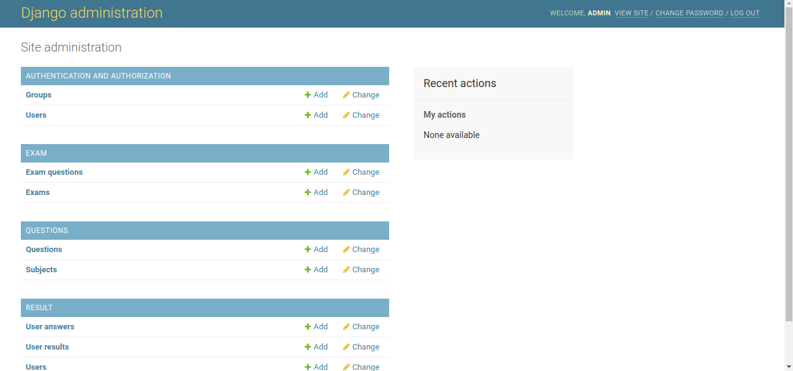

### Add subject:
Admin will add subject from home page. After click on subjects admin will see a list of subjects which he/she have already added.

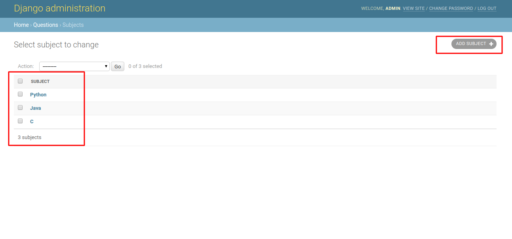

Admin can add a new subject from add subject.

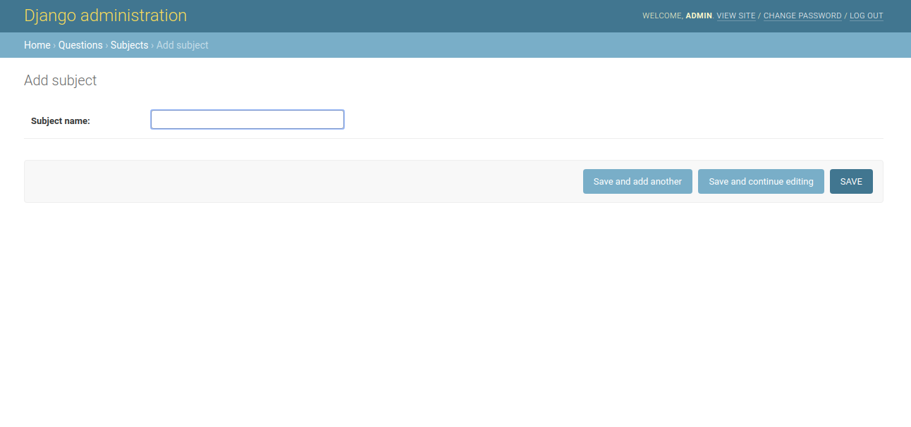

### Add question:
Admin will add question from home page. After click on Questions, admin will see a list of questions which he/she have already added.

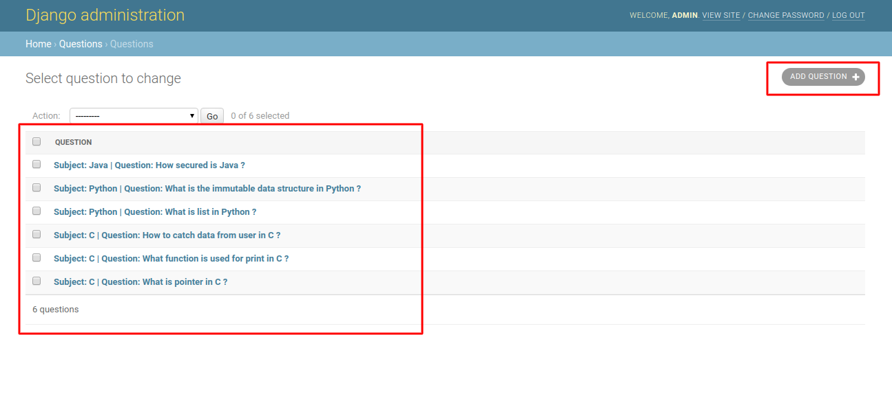

Admin can add a new question from add question.

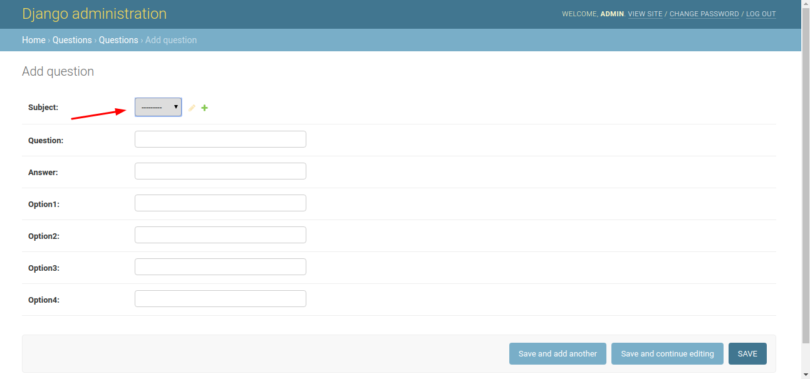

Here admin should select subject from subject drop down. The add question, correct answer and so on.

### Add exam:
After adding subject and questions admin can create an exam will proper title. To add a new examination admin will go exams from the home page.

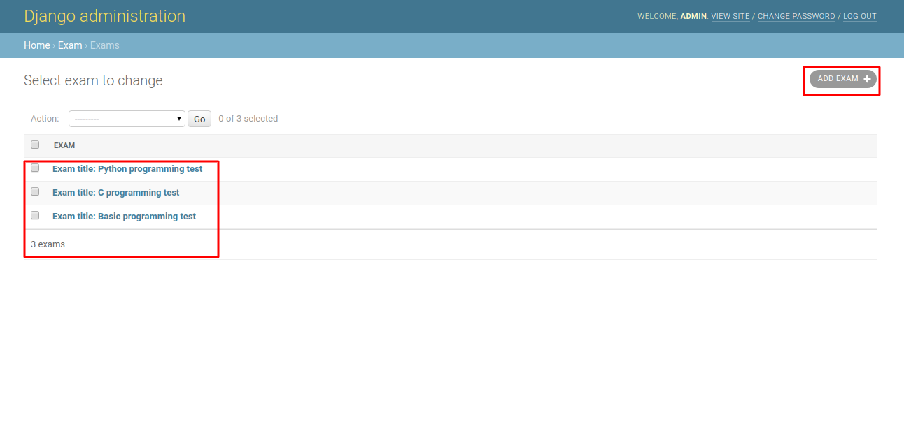

Here admin will see a list of examination. These examinations he/she already added. Admin can create a new one from ADD EXAM. 

After clicking ADD EXAM, admin will show a form. Give the title of the exam and time for this exam. Examination time should be in minutes. But wait !! Do not make it published before adding questions into it. Ok how you can add questions into a exam we will see it in the few minutes. 

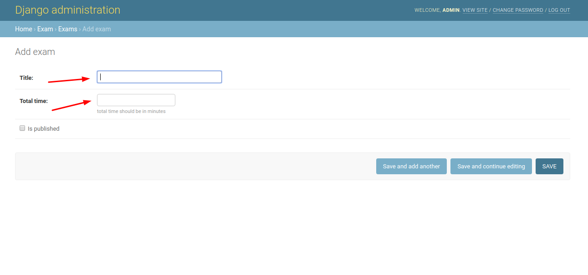

### Add exam's questions:
Click on Exam questions from home page, admin will see a list of questions which he already added to other exams.

Now add some questions to our new created exam from ADD QUESTIONS.


Add exam from exam list and add question from question list.

### Publish an exam:
Now its time to publish a exam. Go to exams from home page and then click on your desired exam. After that make checked on is_published button. After that examinee will see the exam from his exam list page.

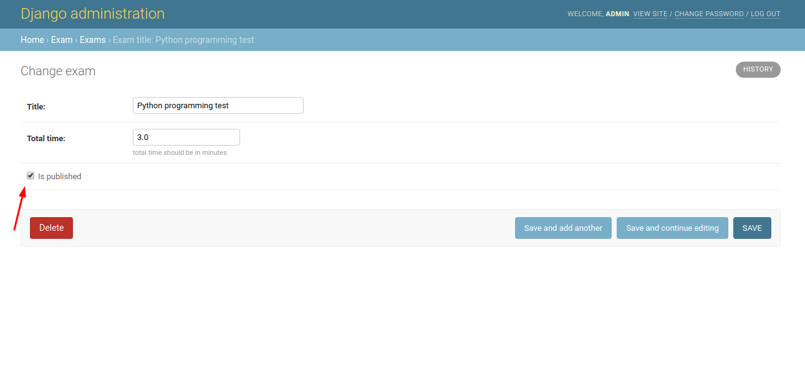

Admin will also see examinee list, their answer sheet and results from Home page bu clicking Users, User answers, User results respectively.

 ## Examinee activities
 First of all, enter admin panel by hitting your local url in your web browser.
```bash
http://127.0.0.1:8000/ergo/
```
## Enter examination system
Examinee have to give his name and email to enter examination system. This is not a login system. He just give his name and email to identify himself in examination result board.

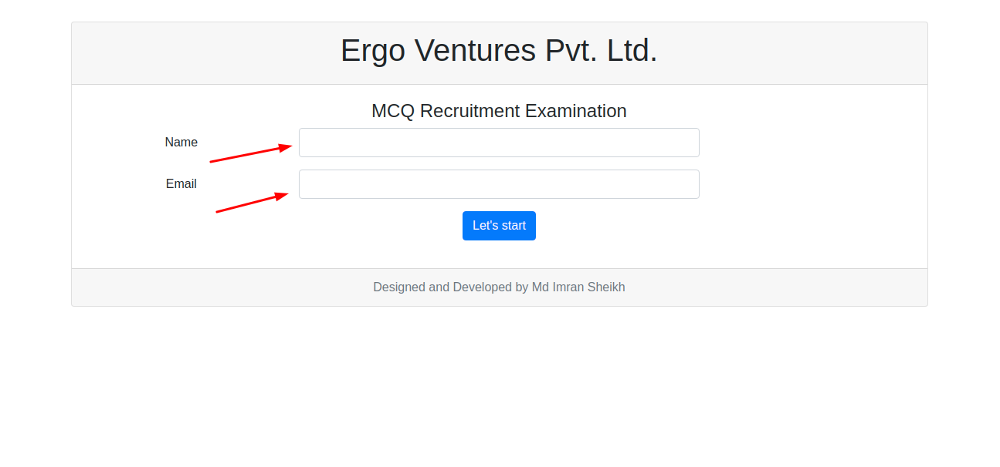

## Acknowledgement
After that, a terms and conditions pop up will appear. Examinee will hit the "Ok, i acknowledged" button. 

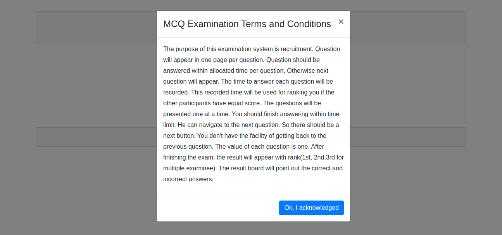

## Examination list
After that, examinee will see a exam list. He/she can choose a  examination from this list and press "Start Exam" button.

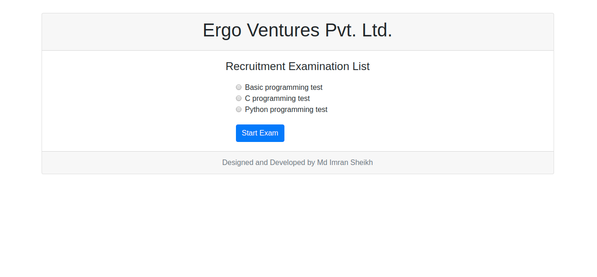

## Give exam
Then the exam will start. Here a time is allocated for per question. Examinee should answer within this time otherwise next question will appear. 

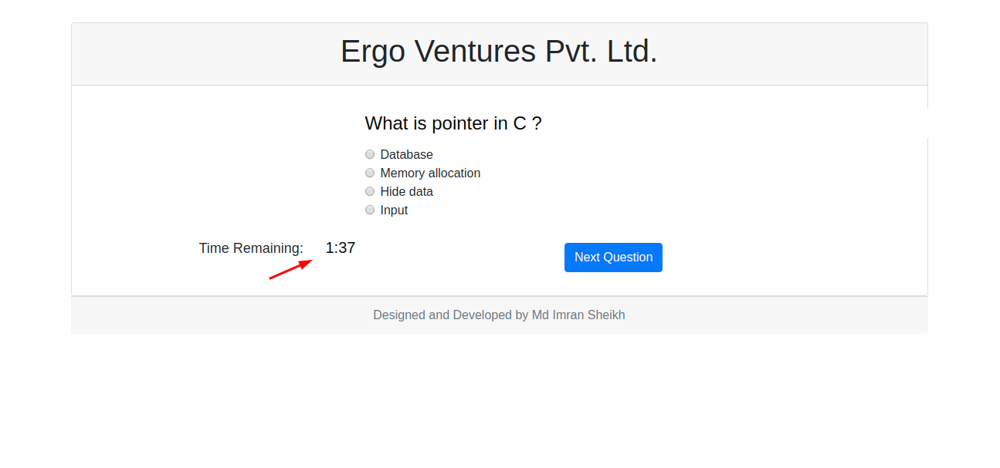

Examinee should select an answer and then press "Next Question" button. Then next question will be appeared.

# Examinee's result board
After completing all questions from exam, finally examinee will see the answer sheet and can see the question wise result and the time he/she spent. 

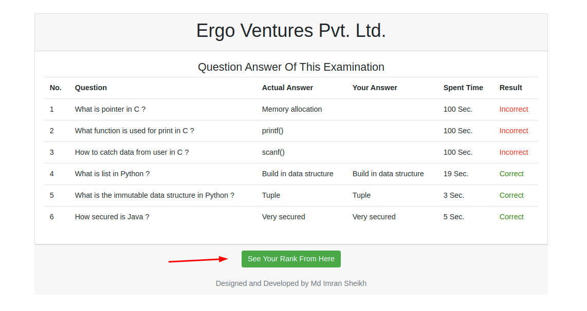

# Examinees Ranking

By clicking "See Your Rank From Here" examinee can see his raking with his marks and time spent. Point to be noted that per question's mark is one (1).

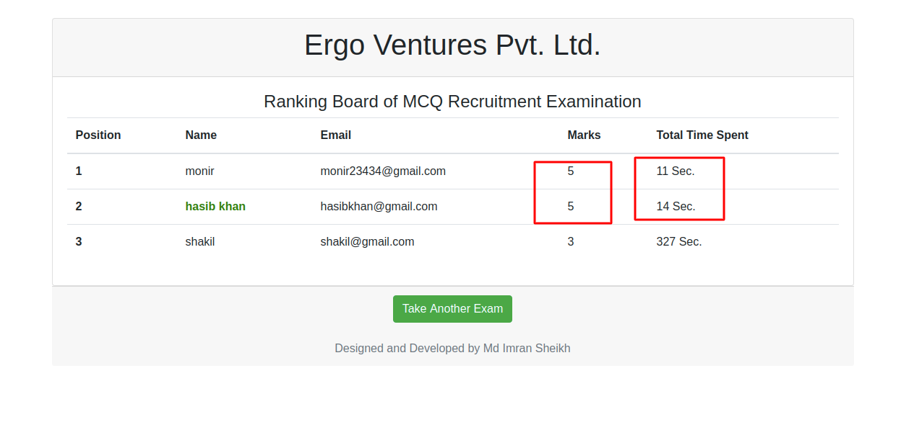

N.B: If two examinee's marks is the same then spent time is a factor of ranking. 


 
